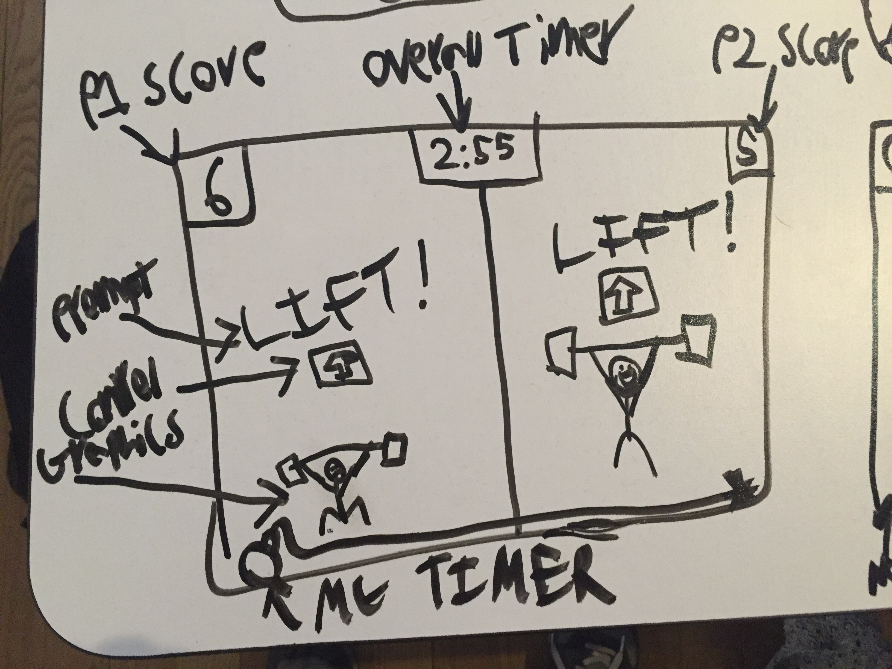
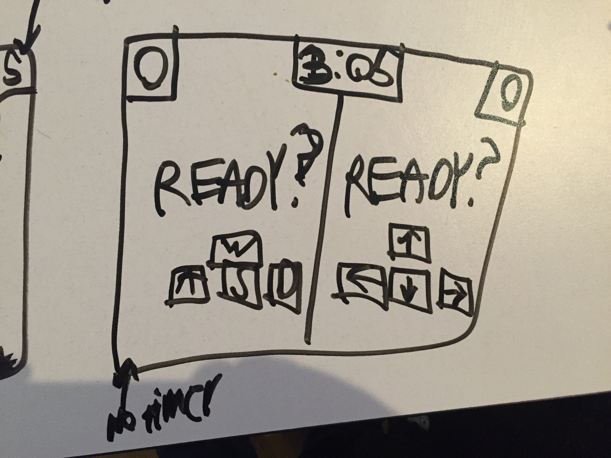
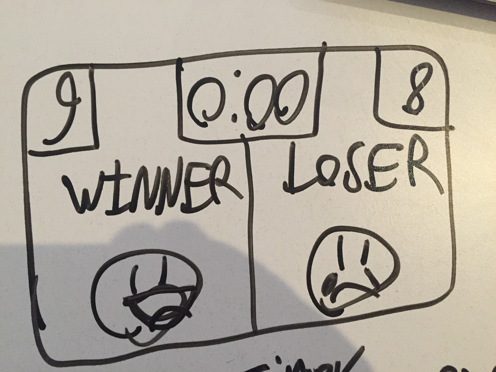
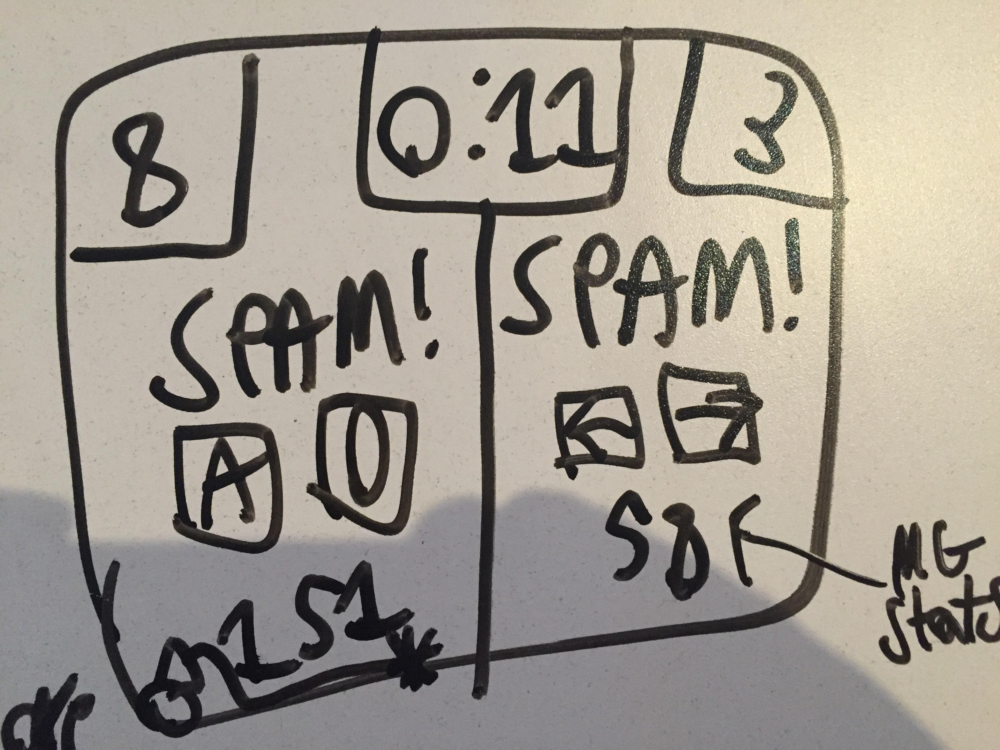

# Lunch Break Battle

_Are you and your co-workers bored on your lunch break? Do you only have ~~ten~~ ~~five~~ **three** minutes left before you have to get back to work? Lunch Break Battle is just the game for you!_

## Proposal

It's [WarioWare](https://en.wikipedia.org/wiki/WarioWare,_Inc.:_Mega_Microgames!) that you can play with your friends in just three minutes (or more)! The game scales the type, speed, difficulty, and amount of minigames based on how much time the players have to play Lunch Break Battle. The players input a an amount of time that they have to play the game (minimum three minutes), and a mini-game queue is generated accordingly. The players play the same mini-game at the same time, and the winner(s) of the minigame get 1 point. Whoever has the most points at the end of the alloted time, wins! The players also share a controller (the keyboard) with player 1 only using the WASD keys, with player 2 only using the arrow keys. The minigames will vary from hitting one's buttons as many times as possible in the alloted time limit, to being quick on the draw in a one-button shootout, to using their directional keys to land a spaceship, etc. All the mini-games will be very simple to allow for a large amount of them to be developed throughout the week. The mini-games will also never have a time limit above 5 seconds, to allow for rapid-fire gameplay and to retain the game's simple design.

## User Stories

* As a player, I want to know how much time is left in the overall game
* As a player, I want to know how much time is left in the mini-game
* As a player, I want the controls for mini-games to be clear to me
* As a player, I want to know my current score
* As a player, I want to know my opponent's score
* As a player, I want it to be clear when I lose a mini-game
* As a player, I want to understand why I lost a mini-game
* As a player, I want it to be clear when I win a mini-game
* As a player, I want to understand why I won a mini-game
* As a player, I want to know exactly what I have to do win a mini-game
* As a player, I want to have audio feedback when I press buttons
* As a player, I want to have audio feedback when a mini-game is complete
* As a player, I want to have an easy time inputting how much time I have to play this game
* As a player, I want to not have to explain to my opponent how to play
* As a player, I want not have to click anywhere on the website
* As a player, I want to be able to enter all of my commands via the keyboard
* As a player, I want the game to have a sense of difficulty progression

## Wireframes

Layout of a mini-game

Starting screen

Ending screen

Another mini-game